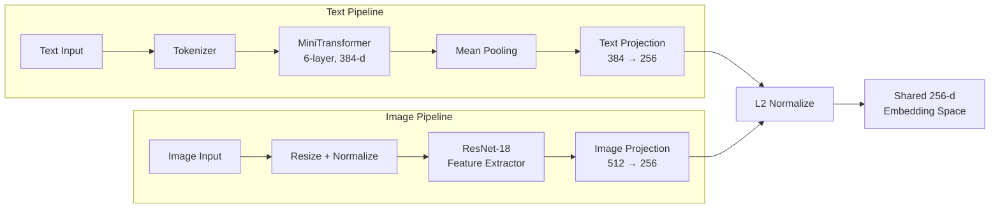

# 🔮 Embedding Model — CLIP-Style Text & Image Embeddings

A from-scratch embedding model that learns a **shared vector space** for text and images using contrastive learning (CLIP-style). Built with PyTorch and a custom MiniTransformer architecture.

## Architecture



**Training is two-stage:**
1. **Text encoder** — trained on SNLI + MultiNLI sentence pairs with contrastive loss (`train.py`)
2. **CLIP extension** — freezes the text encoder, adds a ResNet-18 image tower, and trains with image-text contrastive loss (`train_clip.py`)

---

## File Guide

### Core Model

| File | Purpose |
|------|---------|
| [`model.py`](model.py) | All model architectures: `Embeddings`, `MultiHeadSelfAttention`, `TransformerBlock`, `MiniTransformer` (text encoder), `ProjectionHead`, `ResNetImageEncoder`, and `ClipStyleEmbeddingModel` (full CLIP model) |

### Training

| File | Purpose |
|------|---------|
| [`train.py`](train.py) | Text-only training loop. Trains `MiniTransformer` on NLI sentence pairs with contrastive loss. Contains `HashingTokenizer` (offline fallback tokenizer), gradient accumulation, AMP, and checkpointing |
| [`train_clip.py`](train_clip.py) | CLIP-style training loop. Loads a frozen text backbone, attaches a ResNet image tower, and trains with image-text contrastive loss |

### Data Preparation

| File | Purpose |
|------|---------|
| [`dataset.py`](dataset.py) | NLI dataset utilities: downloads/preprocesses SNLI + MultiNLI, `SentencePairDataset`, `SentencePairCollator` |
| [`clip_dataset.py`](clip_dataset.py) | Image-text dataset: `ImageTextPairDataset` (reads `.jsonl` metadata), `ImageTextCollator`, `build_image_transform` |
| [`prepare_nli_data.py`](prepare_nli_data.py) | Script to download and preprocess SNLI + MultiNLI → `data/nli_pairs/` |
| [`prepare_clip_data.py`](prepare_clip_data.py) | Script to download Flickr8k (or other HF datasets) → `data/clip/` as image + metadata.jsonl |
| [`prepare_cifar10_clip_data.py`](prepare_cifar10_clip_data.py) | Script to export CIFAR-10 → `data/clip/cifar10_train/` as image-text pairs |

### Inference & UI

| File | Purpose |
|------|---------|
| [`inference.py`](inference.py) | Loads the latest checkpoint and exposes `get_text_embedding()` and `get_image_embedding()` functions. Auto-detects checkpoint type (text-only vs CLIP) |
| [`app.py`](app.py) | Streamlit web app — upload images and enter text, visualize embeddings on a 2-D scatter plot (PCA) with similarity heatmap |

### Utilities

| File | Purpose |
|------|---------|
| [`test.py`](test.py) | Quick smoke test — creates a `MiniTransformer`, runs a forward pass, prints output shapes |
| [`utils.py`](utils.py) | Placeholder utility module (currently empty) |

---

## Quick Start

### 1. Prepare Data

```bash
# NLI sentence pairs (for text encoder)
python prepare_nli_data.py

# CIFAR-10 image-text pairs (for CLIP training)
python prepare_cifar10_clip_data.py
```

### 2. Train Text Encoder

```bash
python train.py --epochs 3 --batch-size 16
```

Checkpoints are saved to `checkpoints/`.

### 3. Train CLIP Image Tower

```bash
python train_clip.py \
    --train-metadata data/clip/cifar10_train/metadata.jsonl \
    --image-root data/clip/cifar10_train \
    --epochs 5
```

Checkpoints are saved to `clip_checkpoints/`.

### 4. Run Inference

```bash
python inference.py
```

### 5. Launch Embedding Visualizer

```bash
streamlit run app.py
```

Upload images, type text, and watch the embedding space come alive on a 2-D plot.

---

## Project Structure

```
embedding_model/
├── model.py                      # Model architectures
├── train.py                      # Text encoder training
├── train_clip.py                 # CLIP-style training
├── inference.py                  # Embedding generation API
├── app.py                        # Streamlit visualizer
├── dataset.py                    # NLI dataset utilities
├── clip_dataset.py               # Image-text dataset utilities
├── prepare_nli_data.py           # NLI data prep script
├── prepare_clip_data.py          # Flickr8k data prep script
├── prepare_cifar10_clip_data.py  # CIFAR-10 data prep script
├── test.py                       # Smoke test
├── utils.py                      # Utilities (placeholder)
├── checkpoints/                  # Text encoder checkpoints
├── clip_checkpoints/             # CLIP model checkpoints
└── data/
    ├── nli_pairs/                # Preprocessed NLI data
    └── clip/
        ├── cifar10_train/        # CIFAR-10 image-text pairs
        ├── flickr8k_fast/        # Flickr8k image-text pairs
        └── pokemon_train/        # Pokemon image-text pairs
```
